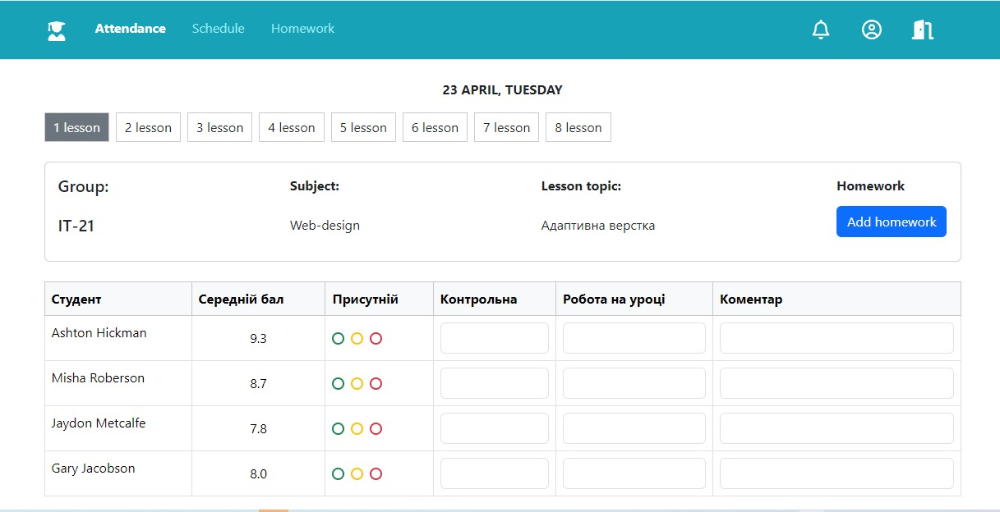
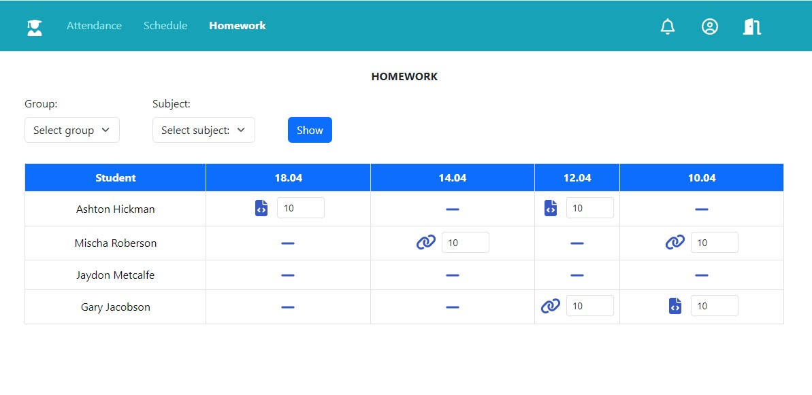

# 🎓 Educational Journal

Адаптивний веб-сайт для ведення електронного журналу викладача. Включає облік відвідуваності, оцінювання студентів, структуру уроків та перегляд домашніх завдань.

## 📘 Мета проєкту

Створити інтерфейс для викладача, який дозволяє:
- Контролювати відвідуваність і активність студентів
- Переглядати оцінки та додавати домашні завдання
- Організовувати навчальні матеріали на кожен урок

## 📌 Основний функціонал

- Навігація між розділами: Attendance / Schedule / Homework
- Вкладки уроків: `1 lesson` → `8 lesson`
- Перегляд інформації про групу, предмет та тему
- Кольорові radio-кнопки для статусу присутності
- Введення оцінок за контрольну, роботу, коментарі
- Модальне вікно для додавання домашнього завдання
- Перегляд завдань у форматі “файл / посилання / відсутній”
- Вибір групи та предмету на сторінці Homework

## 🖼️ Сторінки

### ✅ index.html — Облік уроку

- Інтерфейс перегляду конкретного заняття
- Таблиця студентів з оцінками та статусами присутності
- Кнопка “Add homework” відкриває модальне вікно

### 📘 homework.html — Домашні завдання

- Вибір навчальної групи та предмету
- Таблиця домашніх із датами
- Іконки: `файл`, `посилання`, `відсутність`
- Введення оцінки для кожного завдання

## 🛠️ Технології

- HTML5
- CSS3 (адаптивна верстка)
- Bootstrap 5
- SVG-іконки

## 📂 Структура проєкту

Educational_Journal:
- index.html
- homework.html
- style.css
- img (folder)

## 👩‍💻 Авторка

**Оксана Дубова** — Frontend Developer  
[🔗 GitHub профіль](https://github.com/oksanaDubova-hub)

## 📸 Скриншоти

  
📍 Журнал відвідуваності (index.html)

  

  
📘 Перевірка домашніх завдань (homework.html)

  

## 🚀 Demo

🔹 [Переглянути сайт на GitHub Pages](https://oksanaDubova-hub.github.io/Educational_Journal/)  
🔹 📸 Скриншоти:  
&nbsp;&nbsp;&nbsp;&nbsp;• Журнал відвідуваності  
&nbsp;&nbsp;&nbsp;&nbsp;• Домашні завдання  
🔹 📂 Сторінки:  
&nbsp;&nbsp;&nbsp;&nbsp;• `index.html` — облік занять  
&nbsp;&nbsp;&nbsp;&nbsp;• `homework.html` — перевірка завдань  
🔹 🛠️ Технології: HTML5, CSS3, Bootstrap 5

